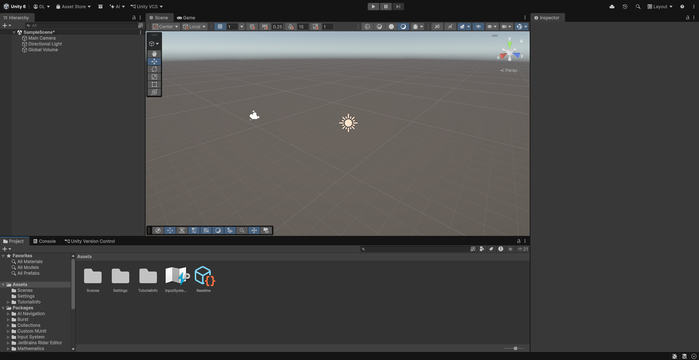
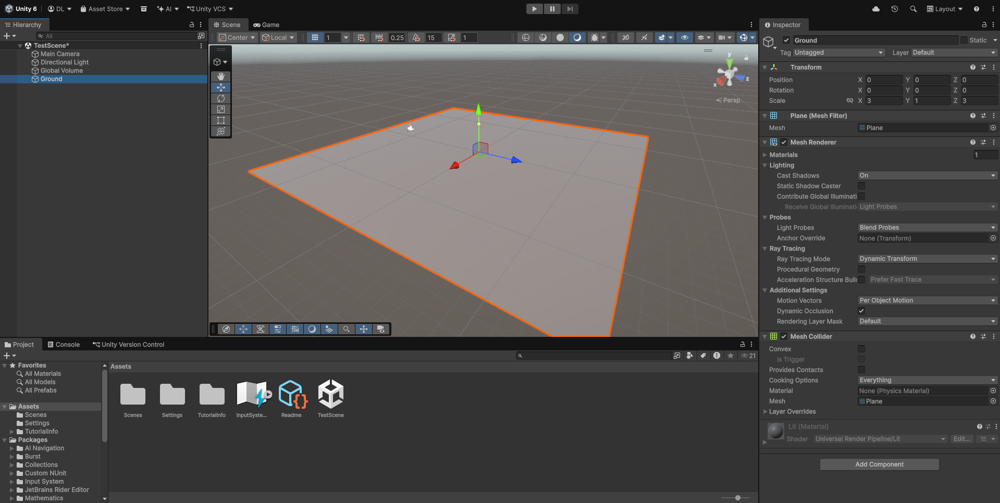
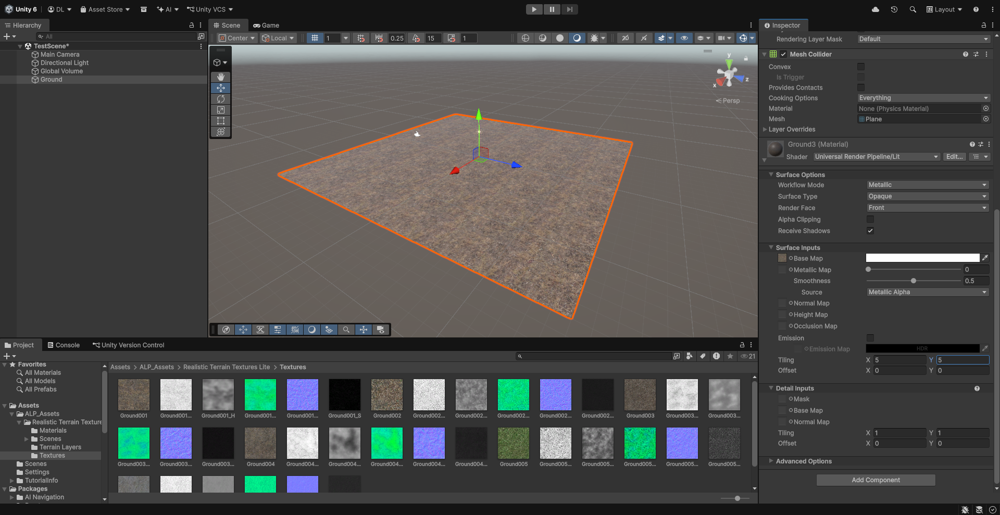
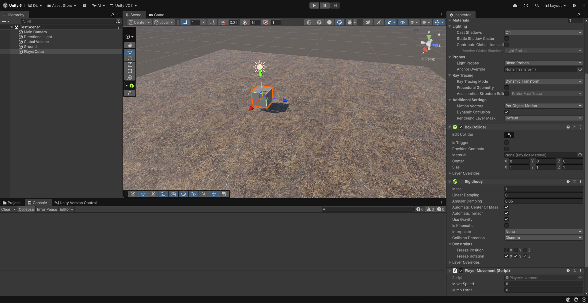
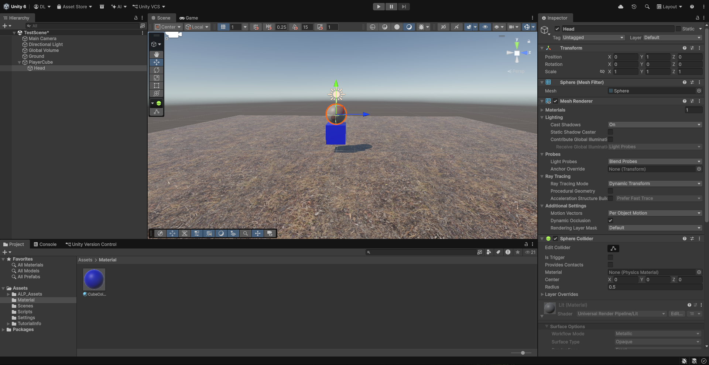
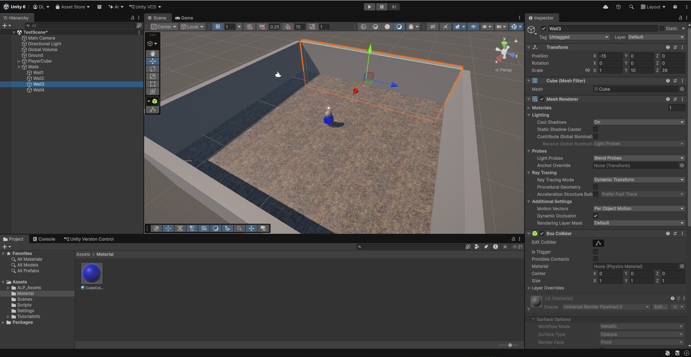

# e-Portfolio Presentation: Unity Engine Basics & Interactive 3D Demo

**Author:** David  
**Topic:** Unity Engine  
**Presentation Date:** 7th May 2026  

---

# 1. Overview

This tutorial serves as a stand-alone guide for my e-Portfolio presentation about the **Unity Engine**.  
It explains the basic concepts of Unity and demonstrates how to create a simple interactive 3D scene from scratch.

The goal of the demo was to show:

- How Unity scenes are structured
- How GameObjects and Components work
- How scripts are used to create interaction
- How physics and movement can be implemented
- How the Asset Store can improve a project

At the end of the tutorial, we created a small playable environment where the player controls a cube, jumps over obstacles, and moves around inside a simple 3D arena.

---

# 2. Core Concepts Demonstrated

The demo showcased the following key Unity concepts:

- **Scenes**  
  A scene represents a level or environment and contains all GameObjects.

- **GameObjects**  
  Every object inside Unity is a GameObject (cube, camera, light, obstacles, etc.).

- **Components**  
  Components define the behavior and properties of GameObjects.

- **Physics System**  
  Rigidbody and Collider components allow realistic movement and collisions.

- **C# Scripting**  
  Scripts are attached to GameObjects to create custom logic and gameplay.

- **Materials & Textures**  
  Materials and imported textures were used to improve the visual appearance.

- **Camera Systems**  
  A custom camera follow system was implemented.

- **Asset Store Integration**  
  External assets and textures were imported into the project.

---

# 3. Demo Goal

The goal of the project was to create a small 3D playground where:

- The player can move a cube
- The cube can jump
- The environment contains walls and obstacles
- The camera follows the player
- Imported textures improve the scene visually

---

# 4. Tutorial: Building the Demo Scene

---

## Step 1: Create a New 3D Scene

First, a new Unity 3D project and scene were created.

The default scene already contained:
- A Main Camera
- A Directional Light
- A Global Volume

These objects form the basic setup of most Unity projects.



---

## Step 2: Add a Ground Plane

A Plane object was added to serve as the ground of the environment.

### How:
1. Right-click inside the Hierarchy
2. Select:
   `3D Object → Plane`

The Plane was then scaled up to create more space for movement.



---

## Step 3: Import and Apply Textures

To demonstrate the Unity Asset Store, terrain textures were downloaded and imported into the project.

The texture was applied to the Plane using a Material.

Additionally, the texture tiling values were adjusted so the texture repeated correctly and did not appear oversized.



---

## Step 4: Create the Player Cube

Next, the controllable player object was created.

### How:
1. Right-click inside the Hierarchy
2. Select:
   `3D Object → Cube`

The cube received:
- A Rigidbody component
- A Box Collider
- A custom PlayerMovement script

The Rigidbody enabled physics-based movement.



---

## Step 5: Create Player Movement

A custom C# script called `PlayerMovement.cs` was created to control the cube.

The script allowed:
- Forward/backward movement
- Left/right movement
- Jumping using the Space key

The movement used Unity physics through the Rigidbody component.

### PlayerMovement.cs

You can find the full script here:

[`scripts/PlayerMovement.cs`](scripts/PlayerMovement.cs)

Preview:

```csharp
using UnityEngine;

public class PlayerMovement : MonoBehaviour
{
    public float moveSpeed = 8f;
    public float jumpForce = 6f;

    private Rigidbody rb;
    private bool isGrounded = true;

    void Start()
    {
        rb = GetComponent<Rigidbody>();
        rb.freezeRotation = true;
    }

    void FixedUpdate()
    {
        float moveX = Input.GetAxis("Horizontal");
        float moveZ = Input.GetAxis("Vertical");

        Vector3 moveDirection = new Vector3(moveX, 0f, moveZ).normalized;

        Vector3 targetVelocity = moveDirection * moveSpeed;
        targetVelocity.y = rb.linearVelocity.y;

        rb.linearVelocity = targetVelocity;
    }
}

void Update()
    {
        if (Input.GetKeyDown(KeyCode.Space) && isGrounded)
        {
            rb.linearVelocity = new Vector3(rb.linearVelocity.x, 0f, rb.linearVelocity.z);
            rb.AddForce(Vector3.up * jumpForce, ForceMode.Impulse);
            isGrounded = false;
        }
    }

    void OnCollisionEnter(Collision collision)
    {
        if (collision.gameObject.CompareTag("Walkable"))
        {
            isGrounded = true;
        }
    }

    void OnCollisionStay(Collision collision)
    {
        if (collision.gameObject.CompareTag("Walkable"))
        {
            isGrounded = true;
        }
    }
}
```

---

## Step 6: Add a Simple Character Design

To make the cube appear more character-like, a Sphere was added as a child object to act as the player's head.

This demonstrated:
- Parent-child hierarchies
- Transform inheritance



---

## Step 7: Build Arena Walls

Four walls were created using scaled Cube objects.

Purpose:
- Prevent the player from falling out of the scene
- Create a small playable arena

Each wall used:
- Mesh Renderer
- Box Collider



---

## Step 8: Add Obstacles

Additional cubes were added as obstacles.

The obstacles demonstrated:
- Collision detection
- Jumping mechanics
- Platform interaction

All walkable objects received the tag:

```text
Walkable
```

This allowed the jump system to detect surfaces correctly.

---

## Step 9: Create a Camera Follow System

A second script called `CameraFollow.cs` was created.

The camera continuously followed the player using an offset position.

You can find the full script here:

[`scripts/CameraFollow.cs`](scripts/CameraFollow.cs)

Preview:

```csharp
using UnityEngine;

public class CameraFollow : MonoBehaviour
{
  public Transform target;
    public Vector3 offset = new Vector3(0f, 6f, -8f);

    void LateUpdate()
    {
        transform.position = target.position + offset;
        transform.LookAt(target);
    }
}
```

---

## Step 10: Attach the Camera Script

The `CameraFollow` script was attached to the Main Camera.

The PlayerCube transform was assigned as the target.

This created a simple third-person camera system.

---

# 5. Final Result

At the end of the demo, the project included:

- A textured 3D environment
- A controllable player
- Physics-based movement
- Jumping mechanics
- Obstacles and collision handling
- Camera tracking
- Imported assets from the Unity Asset Store

The final scene demonstrated how quickly interactive prototypes can be built inside Unity using GameObjects, Components, and C# scripts.

---

# 6. Key Takeaways

1. **Unity uses a component-based system**  
   Functionality is created by combining Components and Scripts.

2. **Scenes organize the game world**  
   Everything inside a level exists within a Scene.

3. **C# scripting enables interaction**  
   Scripts allow developers to create gameplay and custom systems.

4. **Unity is beginner-friendly**  
   Even simple projects can quickly become interactive and playable.

5. **Unity is more than a game engine**  
   The same concepts can also be used for:
   - VR/AR applications
   - Simulations
   - Architecture visualization
   - Medical training
   - Automotive prototypes

---

# 7. Conclusion

Unity is a powerful and beginner-friendly engine that allows developers to quickly create interactive 2D and 3D applications.

This e-Portfolio demonstrated:
- The basic concepts of Unity
- How GameObjects and Components work
- How to use C# scripting
- How physics and movement systems are implemented
- How assets from the Unity Asset Store can be integrated into a project

The practical demo showed how a simple playable scene can be created step by step inside Unity.

Thank you for reading this tutorial and exploring Unity with me.

If you have any questions, feedback, or suggestions, feel free to contact me or open an issue in this repository.
